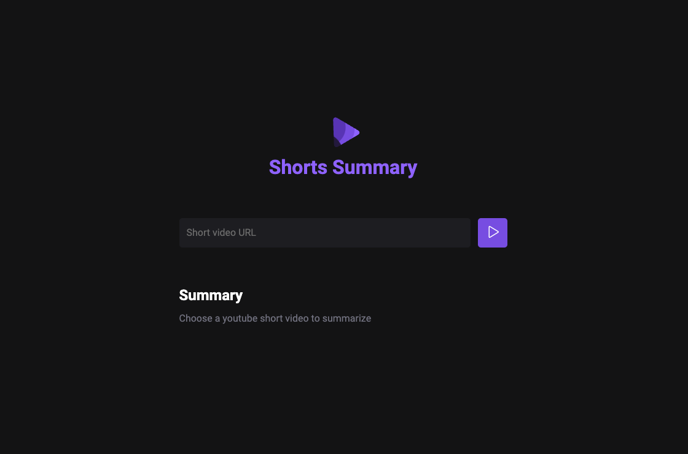

# Shorts-Summary


Web application developed to create summaries of shorts videos from YouTube using AI.




## Deployment

To deploy this project run

```bash
  npm run server
  npm run web
```


## Technologies Used

- Front-end: HTML, CSS, JavaScript
- Back-end: Node.js, Express.js

